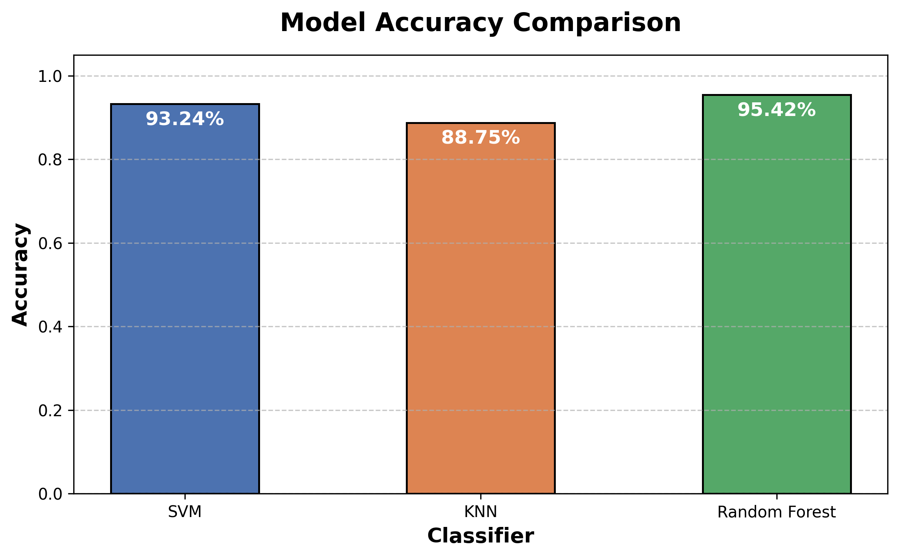
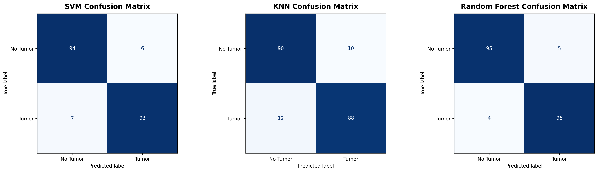

# 🧠 Brain Tumor Detection Using Machine Learning

<p align="left">
  
  
  
</p>

[](https://colab.research.google.com/github/varunvamin/Brain-Tumor-Detection-ML/blob/main/Brain_Tumor_Detection.ipynb)

## 📝 Overview
This project implements a computer vision pipeline and an ensemble of machine learning classifiers to detect the presence of brain tumors in MRI scans. The system features a fully modular, command-line driven architecture with a majority-voting mechanism to ensure high diagnostic reliability.

## 🚀 Quick Start: Test it Instantly!

You don't need to download large datasets or wait for models to train. The pre-trained models are included in this repository, allowing you to run predictions instantly.

1. **Clone the repository:**
   ```bash
   git clone https://github.com/varunvamin/Brain-Tumor-Detection-ML.git
   cd Brain_tumor
   ```

2. **Install dependencies:**
   ```bash
   pip install -r requirements.txt
   ```

3. **Run a prediction on a sample image:**
   *(Ensure you have a sample MRI image. You can place one in a `samples/` directory).*
   ```bash
   python brain_tumor_detection.py --mode predict --image samples/test_image.jpg
   ```
   *The script will instantly output the prediction using a majority vote from SVM, KNN, and Random Forest models.*

---

## ⚙️ Training the Models from Scratch

If you want to train the models yourself, you will need the MRI dataset. 

1. **Download the Dataset:**
   Download the [Brain MRI dataset from Kaggle](https://www.kaggle.com/datasets/navoneel/brain-mri-images-for-brain-tumor-detection) and place the `dataset.zip` file in the root of this project. The zip should contain a `yes` (tumor) and `no` (healthy) folder.

2. **Run Training Mode:**
   ```bash
   python brain_tumor_detection.py --mode train --dataset dataset.zip
   ```
   *This command will:*
   - Extract and preprocess the images (Grayscale, Gaussian Blur, PCA).
   - Train the SVM, KNN, and Random Forest models.
   - Display accuracy metrics and confusion matrices.
   - Save the newly trained models as `.pkl` files in the directory.

## 📈 Model Performance

Below is the visualized performance of the models based on the test dataset:

<p align="center">
  
</p>
<p align="center">
  
</p>

## ✨ Features
- **End-to-End Pipeline**: Complete image preprocessing (Resize, Grayscale, Gaussian Blur, Normalization) combined with PCA for dimensionality reduction.
- **Ensemble Learning**: Utilizes SVM, KNN, and Random Forest classifiers, combining their outputs via a majority voting mechanism to maximize accuracy.
- **Model Persistence**: Uses `joblib` to save and load models, allowing for isolated training and blazing-fast real-time inference.

## 📝 License
This project is open-source and available under the [MIT License](LICENSE).